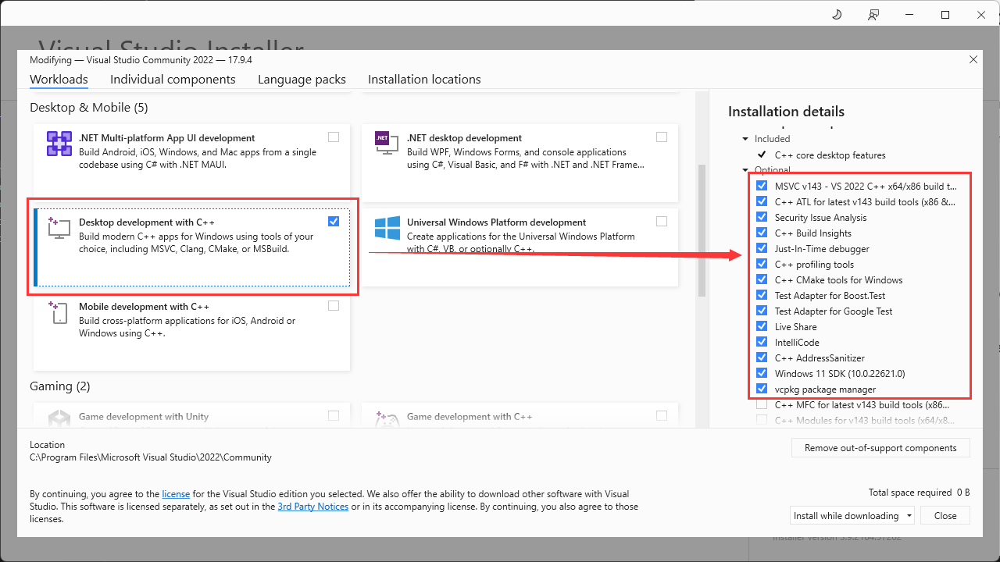

# Env Setup Guide for Windows

## 1. Install Visual Stuidio 2022

Download and install Visual Studio 2022 from the [official website](https://visualstudio.microsoft.com/).

Make sure to install the following components:

- Desktop development with C++
- C++ CMake tools for Windows
- MSVC v143 - VS 2022 C++ x64/x86 build tools (v14.30)



If you missed any of the components, you can modify the installation by running the Visual Studio Installer.

## 2. Set Environment Variables

Setting the environment variables is relatively harder on Windows than on Linux. 

To make your life easier, we provide a script to set the environment variables for you. You can find the script in the `scripts` folder.

**Before runing the script, make sure to check the content CAREFULLY and modify the paths to match your system.**

```bash
pwsh .\scripts\set-env-vars-windows.ps1
```