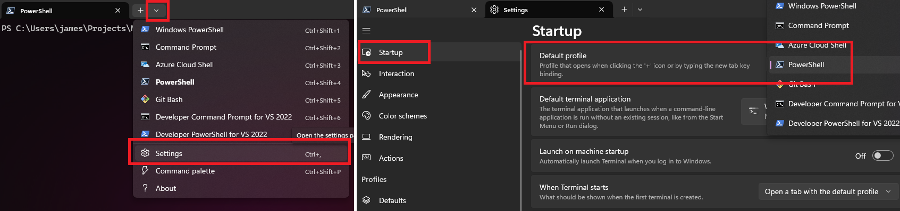
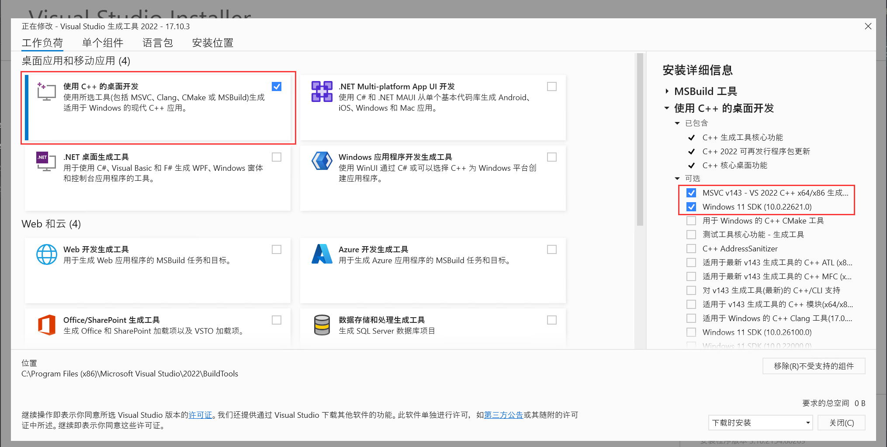

# Env Setup Guide for Windows

## 1. Install PowerShell 7

Open `terminal` and run the following command:

```cmd
winget install --id Microsoft.Powershell --source winget
```

> Note: Default PowerShell on your windows is not PowerShell 7. We recommend using PowerShell 7 for better compatibility.

Open `terminal` and go to `settings`; In `Statup` section, change the `Default profile` to `PowerShell 7`.



## 1. Install Scoop Package Manager

Run the following commands from a regular (non-admin) PowerShell terminal to install Scoop:

```powershell
# Set the execution policy to allow running scripts
# This can be skipped if you are using PowerShell 7
Set-ExecutionPolicy -ExecutionPolicy RemoteSigned -Scope CurrentUser

# Install Scoop
# @params -ScoopDir: The directory where Scoop will be installed.
# @params -ScoopGlobalDir: The directory where the apps installed by Scoop will be stored. Ensure there is no space or Chinese character in ScoopGlobalDir
Invoke-RestMethod -Uri https://get.scoop.sh -outfile 'install.ps1'
.\install.ps1 -ScoopDir 'C:\Scoop' -ScoopGlobalDir 'C:\ScoopApps' -NoProxy
```

## 2. Install Required Packages

```powershell
# Can be ignored if you already have git installed
scoop install main/git  
# Build essentials
scoop install main/llvm  # clang
scoop install main/mingw  # gcc and build tools (MinGW Makefiles)
scoop install main/cmake  # cmake
```

Download and install MSVC and Microsoft C++ Build Tools from the [official website](https://visualstudio.microsoft.com/visual-cpp-build-tools/).



Make sure to install AT LEAST the following components:

- Windows 11 SDK
- MSVC v143 - VS 2022 C++ x64/x86 build tools (v14.30)

If you want a more integrated development environment of Visual Studio, you can simply select `Desktop development with C++` under `Workloads` and then start the installation.

If you missed any of the components, you can modify the installation by running the `Visual Studio Installer`.

To compile the project with MSVC, you will need to add some environment variables to your system. To make your life easier, we have prepared a script to add these environment variables.

```powershell
powershell scripts\set-env-vars-windows.ps1
```